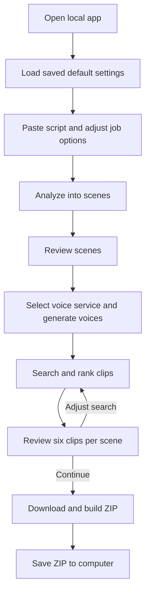
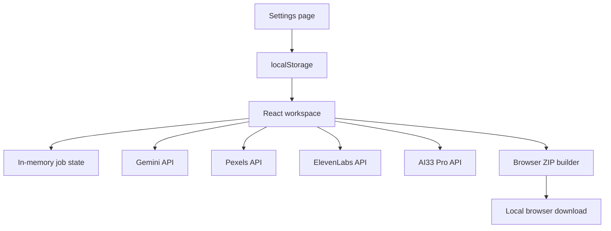

# YouTube Stock Video and Voice Generator — Simplified MVP Project Plan

## 1. Product Summary

Build a private React application that runs locally on the user's computer and converts a YouTube script into an ordered package of relevant stock-video clips and matching voice-over segments generated by ElevenLabs or AI33 Pro.

The user pastes a script, Gemini divides it into short visual scenes and creates search terms, and the application retrieves and ranks six matching videos from Pexels for every included scene. All six are shown for review and exported; no single-video selection is required. After the scene text is finalized, the user selects ElevenLabs or AI33 Pro and the application generates one voice-over file per included scene. It then downloads all six clips and creates one ZIP whose video, voice, and script filenames share the same scene sequence.

Example output:

```text
youtube-video-clips.zip
├── 001-A.mp4
├── ...
├── 001-F.mp4
├── 001.mp3
├── 002-A.mp4
├── ...
├── 002-F.mp4
├── 002.mp3
├── 003-A.mp4
├── ...
├── 003-F.mp4
├── 003.mp3
├── script-segments.txt
├── credits.txt
└── manifest.csv
```

This MVP is intentionally a single-session tool. It does not create projects, save jobs, maintain history, or restore work after the page is refreshed or closed.

## 2. MVP Goal

Reduce the manual work required to create narration, find and review B-roll, and organize the assets for one YouTube video at a time.

### Success criteria

- A user can paste a script and process it without manually splitting every scene.
- Each included scene receives six ranked, exportable Pexels video options.
- The user can preview all six without selecting one.
- All six video options are downloaded using `scene-letter` filenames such as `001-A.mp4` through `001-F.mp4`.
- Each included script scene receives one playable voice-over segment from the selected service: ElevenLabs or AI33 Pro.
- Failed or unsatisfactory voice segments can be regenerated individually.
- The final clips are numbered in script order.
- Voice filenames use the same numbers as their corresponding clips and script lines.
- The application generates and downloads a valid ZIP file.
- All temporary app data is discarded when the browser tab is refreshed or closed.

## 3. Simplified MVP Scope

### Included

- One live workflow at a time
- Script input
- Landscape (16:9) or portrait (9:16) output selection
- Gemini-based scene segmentation and Pexels query generation
- Pexels video search
- ElevenLabs or AI33 Pro text-to-speech generation for every included script scene
- Automatic ranking and `A`–`F` ordering of six Pexels candidates
- Manual scene, clip-set, and voice review
- Browser-based clip downloading and ZIP generation
- Six letter-suffixed MP4 files and one numbered audio file per scene, plus a plain-text script-segment file, manifest, and credits file in the ZIP
- Simple progress and error feedback

### Not included

- Backend server or local Node API
- Database or IndexedDB
- Persistence of scripts, scenes, clip candidate sets, downloads, or job history
- Project management
- Job management or job queues
- Multiple simultaneous projects or workflows
- Saved projects, job history, or recent activity
- Resume or recovery after refresh, browser close, or application restart
- User accounts, authentication, roles, or permissions
- Server deployment or cloud hosting
- Design system page
- Background processing or scheduled cleanup
- Future roadmap

## 4. Core User Flow



Only the current workflow exists. Starting over clears the current script, scenes, generated voices, search results, candidate sets, and generated ZIP from application memory.

## 5. User Interface

The app should use a simple, clean interface with a sophisticated blue as the primary color. It should feel like one guided workspace rather than a project-management application.

### Main navigation

- **Workspace:** The complete script-to-voice-and-video ZIP workflow
- **Settings:** A dedicated page for API keys and default video and voice settings

Use separate routes such as `/` for Workspace and `/settings` for Settings. The Settings page is part of the main navigation. There is no settings modal, settings side panel, or separate design system page.

### Settings page

The dedicated Settings page contains:

- Gemini API key
- Pexels API key
- ElevenLabs API key
- AI33 Pro API key
- Default output orientation: Landscape 16:9 or Portrait 9:16
- Default preferred quality: 720p, 1080p, or 4K when available
- Default target scene length: Short (3–5 seconds), Standard (5–8 seconds), or Long (8–12 seconds)
- Default ElevenLabs voice
- Default ElevenLabs text-to-speech model
- Default audio output format: MP3 44.1 kHz at 64, 96, 128, or 192 kbps; 128 kbps initially and plan-restricted options labelled
- Default voice controls: stability, similarity boost, style, speed, and speaker boost
- Default voice service: ElevenLabs or AI33 Pro
- Default AI33 Pro voice, model/engine, output format, speed, and any other controls confirmed by its official API
- **Test Gemini Key** button
- **Test Pexels Key** button
- **Test ElevenLabs Key** button
- **Test AI33 Pro Key** button
- **Test All Keys** button
- **Save Settings** button
- **Clear API Keys** action
- **Reset Video Defaults** action

API keys should use masked password fields with a show/hide control. The page should indicate whether each required key has been entered. Saving writes the API keys and default video and voice settings to `localStorage` on this computer. The ElevenLabs voice and model selectors load their available choices from the API after a valid key is entered; saved IDs that are no longer available must be shown as unavailable and require a new selection.

Each API key has an inline test-status area with these states:

- Not tested
- Testing
- Valid
- Invalid
- Quota exhausted
- Timed out
- Blocked or unavailable

The test uses the value currently entered in the field, even if it has not been saved yet. Changing a tested key resets its status to **Not tested**. Testing one provider must not prevent any other provider from being saved or tested.

For Pexels, a successful lightweight request should display the monthly request limit, remaining requests, and reset date when the response exposes `X-Ratelimit-Limit`, `X-Ratelimit-Remaining`, and `X-Ratelimit-Reset`. For Gemini, the app should confirm that the key is accepted and that the configured model (`gemini-2.0-flash`) can be accessed. Gemini's remaining project quota or billing credit should be shown only if Google provides it through an accessible API response; otherwise display **“Usage details are available in Google AI Studio”** with a link. Do not estimate or invent a remaining Gemini balance. For ElevenLabs, use the subscription endpoint to validate the key and, when returned, display plan and character usage. For AI33 Pro, use the lightest authenticated health/account/credit operation supported by its current official API and display only returned usage or credits. Do not generate speech merely to test either voice-provider key.

### Step 1 — Script and job settings

- Script text area
- Character and word count
- Output orientation: Landscape 16:9 or Portrait 9:16
- Preferred quality: Prefilled from Settings, with 1080p as the initial fallback
- Target scene length: Short (3–5 seconds), Standard (5–8 seconds), or Long (8–12 seconds)
- Voice service: ElevenLabs or AI33 Pro
- Provider-specific voice and model/engine
- Provider-supported audio output format and tuning controls
- **Analyze Script** button

The video and selected-provider options are prefilled from Settings. The user may change them for the current job without changing saved defaults. API keys are not shown on the Workspace page. A missing Gemini key blocks analysis, the selected voice provider's missing key blocks voice generation, and a missing Pexels key blocks clip search. The unselected voice provider's key is never required.

### Step 2 — Review scenes

Each scene shows:

- Sequence number
- Original script text
- Gemini-generated visual description
- Primary Pexels query
- Editable search query
- Estimated narration duration

The user can edit, split, merge, delete, or reorder scenes before searching for clips.

Actions:

- **Generate Voices**
- **Find Clips**
- **Start Over**

### Step 3 — Generate and review voices

After scene text is approved, automatically generate one voice segment for each included scene using its complete `scriptText`, selected voice service, and current provider settings.

Each scene shows:

- Script text
- Audio player
- Generation status and measured duration
- Provider, voice, model/engine, and output-format summary
- **Regenerate** and **Retry** actions

Generation uses limited concurrency and keeps successful audio blobs in memory only. A text edit, split, merge, or deletion invalidates only the affected voice state. Reordering preserves valid audio and changes only its final export number. The user must regenerate any stale or failed required segment before export.

### Step 4 — Review clips

Each scene card shows:

- Script text and visual description
- Six ranked clip previews labelled `A` through `F`
- Pexels creator and source link
- Duration, orientation, and resolution
- Match label: Strong, Fair, or Weak
- Exactly six exportable clip options when the scene is ready

Actions:

- Edit the query and search again
- Exclude the scene
- Confirm all clip sets
- Generate ZIP
- Start over

Changing the query for one scene must not clear candidate sets for other scenes.

### Step 5 — Generate and download

- Overall progress indicator
- Per-clip download and per-voice readiness status
- Retry button for a failed clip or voice segment
- Cancel button
- Completed ZIP download button
- Start-over button after download

There is no jobs page, project list, history page, or saved-results page.

## 6. Functional Requirements

### FR-1: Persistent settings

- Provide a dedicated Settings page accessible from the main navigation.
- Accept and save Gemini, Pexels, ElevenLabs, and AI33 Pro API keys in `localStorage`.
- Mask API keys by default and provide a show/hide control.
- Store default output orientation, preferred quality, target scene length, default voice provider, and separate ElevenLabs/AI33 Pro defaults in `localStorage`.
- Load saved settings when the app starts.
- Provide actions to clear the API keys and reset video defaults.
- Validate only the key relevant to the requested operation, including only the currently selected voice provider for generation.
- Do not store scripts, scenes, search results, clip candidate sets, progress, or completed job records in `localStorage`.

#### API-key testing

- Provide separate **Test Gemini Key**, **Test Pexels Key**, **Test ElevenLabs Key**, and **Test AI33 Pro Key** actions plus **Test All Keys**.
- Test the current unsaved field value rather than only the last saved value.
- Disable a provider's test button while its test is in progress.
- Allow all four provider tests to run independently.
- Apply a short timeout and allow a failed test to be retried.
- Distinguish invalid credentials (`401` or `403`), quota exhaustion (`429`), network/CORS failure, timeout, and provider failure.
- Never consume the entered key in a heavier generation or search request than necessary for validation.
- Clear the previous result when the corresponding key is edited.

For Gemini:

- Make a lightweight authenticated request using direct browser `fetch` to the Google Generative Language REST API (`gemini-2.0-flash`) that confirms the key and access to the model.
- Show **Valid** when authentication and model access succeed.
- If available in the response, show useful quota or rate-limit metadata.
- Do not claim to show remaining credit, tokens, requests, or billing balance when Gemini does not expose those values to the request.
- Provide a link to Google AI Studio for project-level rate limits and usage details when the remaining balance cannot be retrieved.

For Pexels:

- Make one lightweight authenticated request, preferably a one-result video request.
- Show **Valid** when the request succeeds.
- Read and display `X-Ratelimit-Limit`, `X-Ratelimit-Remaining`, and `X-Ratelimit-Reset` from a successful response when those headers are accessible to browser JavaScript.
- Format the reset value as a readable local date and time.
- Explain that the test itself consumes one Pexels API request.
- If the request succeeds but the headers are unavailable, show the key as valid and label usage information as unavailable rather than failing the test.

For ElevenLabs:

- Make a lightweight authenticated `GET /v1/user/subscription` request that does not consume text-to-speech characters.
- Show **Valid** when the subscription request succeeds.
- When returned, display the subscription tier, `character_count`, `character_limit`, calculated remaining characters, and `next_character_count_reset_unix` as a readable local date and time.
- Clamp displayed remaining characters to zero when `character_count` exceeds `character_limit`; do not present it as a guarantee when usage-based overages are enabled.
- Load available voices from `GET /v2/voices` and text-to-speech-capable models from `GET /v1/models` for the default selectors.
- Keep key validity separate from voice/model availability so an empty voice list or unavailable saved selection does not mislabel a valid key as invalid.

For AI33 Pro:

- Use the lightest current official authenticated health/account/credit operation and do not generate speech during key testing.
- Display returned usage or credits without estimating unavailable values.
- Load voices and models/engines through documented discovery endpoints when available.
- Verify the official endpoint paths, auth headers, response schemas, and browser CORS support during Phase 1; isolate these details in `ai33Pro.ts`.

### FR-2: Script intake

- Accept plain text up to an initial configurable limit, recommended at 5,000 words.
- Reject an empty script.
- Remove unnecessary surrounding whitespace.
- Keep the original script unchanged in memory for review.
- Process only one script at a time.
- Initialize each new job with saved video defaults, the default voice provider, and that provider's defaults.
- Allow the user to change the voice provider and override its supported settings for the current job only.
- Do not overwrite saved defaults when job-level options are changed on the Workspace page.

### FR-3: Intelligent segmentation

- Call Gemini directly from the browser.
- Divide the script by visual idea instead of a fixed sentence count.
- Keep narration context intact.
- Avoid standalone transition segments such as “however” or “because of this.”
- Target the selected scene-duration range using an estimated narration speed of 140–160 words per minute.
- Request structured JSON for each segment.

Example:

```json
{
  "sequence": 1,
  "scriptText": "Regular walking can improve balance and confidence.",
  "visualDescription": "An active senior walking confidently in a sunny park",
  "primaryQuery": "active senior walking park",
  "fallbackQueries": ["older adult outdoor exercise", "senior fitness walking"],
  "avoidTerms": ["wheelchair", "hospital"],
  "estimatedSeconds": 6
}
```

- Validate Gemini's response before showing it.
- Show a clear retry option if the response is invalid or the request fails.

### FR-4: Scene review

- Allow scene text, visual descriptions, and search queries to be edited.
- Allow scenes to be split, merged, deleted, and reordered.
- Renumber scenes automatically after changes.
- Invalidate generated audio for a scene when its script text changes or when it is split or merged.
- Preserve valid scene audio during reordering; export numbering is assigned later from final scene order.
- Keep all changes only in React state.

### FR-5: Pexels search

- Call the Pexels API directly from the browser.
- Apply the selected orientation and appropriate size filters.
- Produce and display exactly six exportable candidate videos for each ready included scene.
- Start with Pexels `per_page=6`; request more through fallback queries only when filtering or deduplication leaves fewer than six.
- If fallback queries are used, merge, deduplicate, and rank their results, then keep the best six candidates overall.
- Use the primary query first and fallback queries when necessary.
- Avoid using the same Pexels video for multiple scenes by default.
- Show a clear message for quota errors, connection failures, and empty results.
- Avoid repeating an identical API request during the current session by keeping a small in-memory query cache.

### FR-6: Candidate ranking

Rank candidates using:

1. Query and metadata relevance
2. Correct orientation
3. Minimum resolution
4. Duration suitability
5. Duplicate avoidance

The six highest-scoring unique candidates are ordered and labelled `A` through `F`. No candidate is preselected.

### FR-7: Candidate-set review

- Show playable previews where the provider permits them.
- Show all six candidates and do not show a single-selection control.
- Allow a custom query and scene-specific re-search.
- Preserve candidate sets for unaffected scenes.
- Block ZIP generation until every included scene has six valid exportable candidates.
- Allow the user to intentionally exclude a scene.

### FR-8: Multi-provider voice generation

- Call the selected provider—ElevenLabs or AI33 Pro—through a provider adapter using only that provider's saved API key.
- Generate one audio file from the complete `scriptText` of every included scene.
- Use only settings supported by the selected provider; keep ElevenLabs-specific controls out of AI33 Pro requests unless officially supported.
- Use MP3 44.1 kHz / 128 kbps as the initial output fallback (`mp3_44100_128`).
- Pass adjacent scene text as continuity context where supported, without changing the spoken content of the current scene.
- Generate automatically as a limited-concurrency batch after the user confirms the scene list.
- Show per-scene queued, generating, ready, failed, cancelled, and stale states.
- Provide playback plus per-scene **Regenerate** and **Retry** actions.
- Keep audio blobs, request IDs, measured durations, and object URLs only in memory.
- Abort active requests on cancellation or **Start Over** and revoke replaced object URLs.
- Block final ZIP generation while any included scene lacks a current successful voice segment.
- Treat a provider-returned request ID as optional; generation must still succeed when the browser cannot read that header.
- Support AI33 Pro task creation, bounded polling, terminal failure, cancellation, and final audio retrieval when its verified API is asynchronous.

### FR-9: Browser-based downloading

- Choose the MP4 file closest to the requested resolution and orientation.
- Fetch all six candidate video files per included scene directly in the browser.
- Validate the HTTP response and ensure each downloaded file is non-empty.
- Retry an individual failed download without restarting the entire workflow.
- Limit concurrent downloads to avoid excessive memory and bandwidth usage.
- Do not crop, upscale, or trim clips in this MVP.

### FR-10: ZIP generation

- Generate the ZIP in the browser using a library such as JSZip.
- Zero-pad scene numbers with at least three digits and append candidate letters: `001-A.mp4` through `001-F.mp4`, then `002-A.mp4` through `002-F.mp4`.
- Keep numbering aligned with the current scene order.
- Include one selected-provider audio file per included scene using the numeric scene basename: `001.mp3`, `002.mp3`, and so on.
- Include `script-segments.txt` encoded as UTF-8.
- Write every included script segment to `script-segments.txt` in final video order, with exactly one numbered segment per line.
- Replace any line breaks inside an individual segment with a single space so one segment never occupies multiple lines.
- Prefix each line with the numeric scene sequence shared by its six videos, for example `001. Regular walking can improve balance and confidence.` for `001-A.mp4` through `001-F.mp4`.
- Do not add headings or blank separator lines.
- Omit intentionally excluded scenes so scene numbering has no gaps.
- Include `manifest.csv` with one row per MP4 (six per included scene), candidate label, script text, query, Pexels details, video filename, voice filename, voice provider, voice/model IDs, output format, and measured audio duration.
- Include `credits.txt` with Pexels and creator links.
- Trigger a standard browser download for the completed ZIP.
- Release large in-memory file objects after download or cancellation.

### FR-11: Start over and cancellation

- Provide a visible **Start Over** action.
- Ask for confirmation if the current workflow contains generated scenes or clip results.
- Clear the script, scenes, voice audio, results, candidate sets, progress, and generated ZIP from memory.
- Allow active analysis, voice generation, searching, or downloading to be cancelled using browser request cancellation.

## 7. Recommended Technical Architecture

| Area | MVP choice | Responsibility |
| --- | --- | --- |
| Application | React 19 + TypeScript + Vite + `react-router-dom` | Entire user interface and workflow routing (`/` and `/settings`) |
| Active state | In-memory Zustand store | Current script, job-specific options, scenes, six-candidate searches, voice state, and progress |
| AI | Gemini REST API (`gemini-2.0-flash`) via browser `fetch` | Scene segmentation and query generation |
| Stock provider | Pexels Video REST API via browser `fetch` | Video discovery and source metadata |
| Voice providers | ElevenLabs and AI33 Pro adapters via browser `fetch` | Provider-specific discovery, usage/credits, generation, polling when needed, and normalized audio results |
| Packaging | JSZip | Create the final ZIP in browser memory |
| Download | Browser Fetch, Blob, and standard object URLs | Fetch clips and save the ZIP |
| Settings persistence | Browser `localStorage` | API keys and default video and voice settings only |
| Key validation | Lightweight Gemini, Pexels, ElevenLabs, and AI33 Pro requests | Validate entered keys independently and show returned usage metadata |

### Component flow



There is no backend, database, local server API, job queue, or application-managed filesystem directory. `localStorage` is used only for API keys and default video and voice settings. Generated speech remains in browser memory until it is added to the final download or cleared.

## 8. Suggested Frontend Structure

```text
src/
├── components/
│   ├── ScriptInput.tsx
│   ├── SceneEditor.tsx
│   ├── SceneCard.tsx
│   ├── ClipPreview.tsx
│   ├── ClipOptions.tsx
│   ├── VoiceGenerationPanel.tsx
│   ├── VoiceSegmentCard.tsx
│   ├── ProgressPanel.tsx
│   └── JobOptions.tsx
├── pages/
│   ├── WorkspacePage.tsx
│   └── SettingsPage.tsx
├── services/
│   ├── gemini.ts
│   ├── pexels.ts
│   ├── elevenLabs.ts
│   ├── ai33Pro.ts
│   ├── voiceProvider.ts
│   ├── ranking.ts
│   ├── downloader.ts
│   └── zipBuilder.ts
├── hooks/
│   └── useVideoWorkflow.ts
├── types/
│   └── index.ts
├── utils/
│   ├── filenames.ts
│   ├── manifest.ts
│   └── validation.ts
├── App.tsx
└── main.tsx
```

Keep API integrations and ZIP logic outside UI components so the core workflow can be tested independently.

## 9. Application State and Saved Settings

The application separates persistent configuration from temporary job data.

### Saved in `localStorage`

```ts
type SavedSettings = {
  geminiApiKey: string;
  pexelsApiKey: string;
  ai33ProApiKey: string;
  elevenLabsApiKey: string;
  defaultOrientation: 'landscape' | 'portrait';
  defaultQuality: '720p' | '1080p' | '4k';
  defaultSceneLength: 'short' | 'standard' | 'long';
  defaultElevenLabs: {
    voiceId: string;
    modelId: string;
    outputFormat:
      | 'mp3_44100_64'
      | 'mp3_44100_96'
      | 'mp3_44100_128'
      | 'mp3_44100_192';
    stability: number;
    similarityBoost: number;
    style: number;
    speed: number;
    useSpeakerBoost: boolean;
  };
  defaultVoiceProvider: 'elevenlabs' | 'ai33pro';
  defaultAi33Pro: {
    voiceId: string;
    modelId?: string;
    outputFormat: string;
    speed?: number;
    supportedOptions: Record<string, string | number | boolean>;
  };
};
```

Migrate existing `.settings.v1`/`.settings.v2` values to `.settings.v3` without losing saved Gemini, Pexels, ElevenLabs, video, or voice defaults. Use ElevenLabs as the migrated default provider for backward compatibility. Do not hardcode a voice for either provider; availability depends on the user's account.

Key-test status, error details, returned Pexels limits, and test timestamps are temporary UI state. They should not be treated as authoritative after the key changes and do not need to be stored in `localStorage`.

### Kept only in memory

```ts
type WorkflowState = {
  step: 'setup' | 'scenes' | 'voices' | 'clips' | 'packaging' | 'complete';
  script: string;
  options: WorkflowOptions;
  scenes: Scene[];
  voiceStateByScene: Record<string, VoiceSegmentState>;
  searchStateByScene: Record<string, SceneSearchState>;
  excludedSceneIds: string[];
  exportState: ExportState | null;
  error: string | null;
};
```

Only `SavedSettings` is synchronized to `localStorage`. `WorkflowState` must not be written to `localStorage`, IndexedDB, a database, or a file. Refreshing the page clears the active job and generated audio while retaining the saved API keys and default video and voice settings.

## 10. Matching Strategy

Exact matches cannot be guaranteed because Pexels searches an existing stock catalogue. The MVP should improve relevance through a small, understandable pipeline:

1. Convert narration into a concrete visual description.
2. Focus on visible subjects, actions, settings, moods, and demographics.
3. Generate one primary query and two broader fallback queries.
4. Retrieve and retain the six highest-ranked usable candidate clips.
5. Filter by orientation, resolution, duration, and duplication.
6. Rank the remaining clips.
7. Label the six results `A` through `F`, show them all, and export them all.

| Script | Weak literal query | Better visual query |
| --- | --- | --- |
| “High blood pressure can silently damage the kidneys.” | `blood pressure kidney damage` | `senior checking blood pressure at home` |
| “Small daily habits add up over time.” | `daily habits over time` | `older adult healthy morning routine` |

## 11. Important Browser Constraint

Because the MVP has no backend, the browser must be able to call Gemini, Pexels, ElevenLabs, AI33 Pro, and the selected video-file URLs directly. Before implementation, confirm:

- Gemini requests work from the local browser origin.
- Pexels search requests work from the local browser origin.
- Pexels rate-limit headers are exposed to browser JavaScript and can be read by the Settings page.
- ElevenLabs subscription, voices, models, and text-to-speech requests work from the local browser origin.
- ElevenLabs response audio and any request-ID header needed for continuity are accessible to browser JavaScript.
- AI33 Pro account/credits, voices/models, text-to-speech, task polling, and audio retrieval work from the local browser origin using the current official API.
- Selected MP4 URLs allow browser fetching through CORS.
- Several representative clips can be stored as browser `Blob` objects and added to a ZIP.
- The expected script size and clip count fit within acceptable browser memory usage.

If a provider blocks browser requests through CORS, a frontend-only implementation cannot bypass that restriction. The simplest response is to choose a browser-compatible endpoint or change the download interaction; adding a backend would be a separate scope decision.

## 12. Non-Functional Requirements

- **Simplicity:** The user completes one guided workflow without project or job concepts.
- **Responsiveness:** Editing and review actions update immediately.
- **Progress:** Voice generation, searches, downloads, and packaging display clear progress.
- **Reliability:** A failed voice segment, scene search, or clip download can be retried individually during the current session.
- **Memory control:** Voice generation and downloads use limited concurrency, and object URLs and large blobs are released when no longer needed.
- **Accessibility:** Controls are keyboard accessible, previews are labelled, and status messages are readable.
- **Compatibility:** Support the latest desktop versions of Chrome or Edge for the initial MVP.

## 13. Implementation Plan

Estimated incremental work for these changes: **3–5 working days for one experienced frontend developer**, subject to AI33 Pro API/CORS validation and the increased download volume from six clips per scene.

### Phase 1 — Technical proof of concept (0.5–1 day)

- Create a minimal React + TypeScript + Vite app.
- Test direct Gemini, Pexels, ElevenLabs, and AI33 Pro requests from the browser.
- Confirm the lightest reliable key-validation request for each provider.
- Confirm whether Pexels rate-limit headers can be read by browser JavaScript.
- Confirm that Gemini does not expose a remaining balance through the chosen validation response; if it does, document the supported fields.
- Confirm ElevenLabs subscription usage, voice listing, model listing, text-to-speech audio, response headers, and CORS behavior.
- Confirm AI33 Pro authentication, account/credits, voice/model discovery, text-to-speech request, polling if asynchronous, audio retrieval, and CORS behavior from current official documentation.
- Test downloading representative Pexels MP4 files as blobs.
- Test browser-side ZIP generation with several clips.
- Record any browser, CORS, or memory limitation that changes the MVP.

**Exit:** The complete frontend-only request and download path is proven.

### Phase 2 — Script and scene workflow (1–2 days)

- Build the dedicated Settings page and main navigation.
- Add `localStorage` loading, validation, saving, clearing, and default-reset behavior.
- Add independent API-key testing for all four providers, status messages, timeout handling, and available usage details.
- Build the Workspace script-entry interface with defaults prefilled from saved settings.
- Add in-memory job state and per-job video-setting overrides.
- Implement structured Gemini output and response validation.
- Build scene editing, splitting, merging, deletion, and reordering.

**Exit:** A pasted script becomes an approved ordered scene list with video and voice settings initialized for the current workflow.

### Phase 3 — Multi-provider voice generation and review (1.5–2.5 days)

- Add the ElevenLabs API key, usage display, voices, models, and default voice controls to Settings.
- Add the AI33 Pro key, available usage/credits, and provider options to Settings.
- Migrate saved settings from schema v2 to v3.
- Add default and current-workflow voice-provider selection.
- Introduce a provider adapter and implement the AI33 Pro request/poll/download flow.
- Implement per-scene text-to-speech generation with limited concurrency, cancellation, playback, retry, and regeneration.
- Measure audio duration in the browser and invalidate only affected audio after scene edits.
- Keep audio blobs and object URLs in memory and release replaced data.

**Exit:** Every included scene has a reviewed, current voice segment.

### Phase 4 — Clip discovery and review (1–2 days)

- Implement Pexels search and normalize results.
- Add orientation, resolution, duration, and duplicate filters.
- Add ranking and `A`–`F` ordering for six candidates.
- Build six-clip previews, custom re-search, exclusion, and completeness validation without a selection control.

**Exit:** Every included scene has six reviewed, exportable clips.

### Phase 5 — Download and packaging (1–2 days)

- Implement limited-concurrency downloading of all six clips per included scene.
- Add per-clip progress, cancellation, and retry.
- Generate `001-A`…`001-F` MP4 filenames, one scene-level audio filename, `script-segments.txt`, the extended `manifest.csv`, and `credits.txt`.
- Build and download the ZIP in the browser.
- Release temporary blobs and object URLs after use.

**Exit:** The user can download a correct, ordered ZIP.

### Phase 6 — Testing and polish (1 day)

- Test API failures, malformed Gemini responses, incomplete six-result searches, both voice-provider quota errors, asynchronous AI33 Pro failures, failed voice generation, and failed downloads.
- Test short and long scripts in both orientations.
- Verify reset behavior and confirm that refresh restores no previous workflow.
- Improve loading, empty, error, and completion states.
- Write short local setup and usage instructions.

**Exit:** All MVP acceptance criteria pass on the target desktop browser.

## 14. MVP Acceptance Criteria

1. The app runs locally as a React frontend without a backend service.
2. The user can save Gemini, Pexels, ElevenLabs, and AI33 Pro API keys on a dedicated Settings page.
3. The user can save default video options, a default voice provider, and separate provider-specific voice settings.
4. The user can test each of the four entered API keys before or after saving it.
5. Gemini testing reports authentication and model-access success or a clear failure state.
6. Pexels testing reports validity and displays limit, remaining requests, and reset time when the response headers are browser-accessible.
7. Unavailable usage data is labelled unavailable and is never estimated.
8. A new job is prefilled with the saved video defaults, default voice provider, and that provider's defaults; job-level changes do not alter saved defaults.
9. A valid script produces editable, ordered visual scenes.
10. Each scene includes source text, a visual description, and a search query.
11. Every ready included scene has exactly six playable, deduplicated Pexels candidates in the requested orientation when available.
12. All six candidates are displayed in ranked `A`–`F` order with no selection control.
13. Reordering scenes changes the final file numbering.
14. The app generates one playable audio segment from the selected provider for each included scene and supports individual playback, retry, and regeneration.
15. A scene-text edit invalidates that scene's audio, while scene reordering preserves valid audio.
16. ZIP generation is blocked until every included scene has both a current voice segment and six valid video candidates.
17. An individual failed voice generation, search, or download can be retried during the current session.
18. The ZIP contains six playable `A`–`F` MP4 files and one audio file per included scene, with aligned scene numbers and no gaps.
19. `script-segments.txt` contains exactly one numbered line per included scene; each number matches the numeric prefix of its six MP4 files and its audio filename.
20. `manifest.csv` identifies the included clips and voice-generation settings, while `credits.txt` correctly identifies the included video sources.
21. Clicking **Start Over**, refreshing, or reopening the app removes the active script, scenes, audio, search results, candidate sets, and job record.
22. Refreshing or reopening the app retains the saved API keys and default video and voice settings.
23. No job, generated audio, or workflow data is written to `localStorage`, IndexedDB, a database, or application-managed files.

## 15. Test Plan

### Unit tests

- Gemini response validation
- Query normalization
- Candidate ranking
- Video-file variant selection
- Filename numbering
- Candidate-letter assignment and six-file scene completeness
- Manifest and credits generation
- Script-segment text normalization, zero-padded numbering, and one-segment-per-line export
- In-memory reset behavior
- Settings serialization, validation, and fallback defaults
- API-key test state transitions and reset-on-edit behavior
- Pexels rate-limit header parsing and reset-date formatting
- Settings v2-to-v3 migration and provider-default preservation
- ElevenLabs voice-setting validation and request-payload mapping
- AI33 Pro option validation, task polling, and normalized result mapping
- Voice-state invalidation after edit, split, merge, delete, and reorder actions
- MP3 filename alignment and voice metadata generation

### Integration tests

- Gemini success, timeout, quota error, and malformed response
- Pexels success, empty result, rate-limit response, and server error
- Pexels primary and fallback searches produce six deduplicated candidates per ready scene and never export more than six
- Browser fetch of representative MP4 URLs
- ZIP generation with six clips per included scene
- Individual retry and cancellation
- Confirmation that `localStorage` contains only API keys and default video/voice settings
- Gemini and Pexels valid-key, invalid-key, `429`, timeout, and network/CORS test results
- Pexels success with and without readable rate-limit headers
- ElevenLabs valid-key, invalid-key, quota, timeout, and network/CORS results
- ElevenLabs voice and model loading with unavailable saved selections
- AI33 Pro valid/invalid key, credits, voice/model loading, asynchronous completion/failure, timeout, and CORS results
- Multi-scene voice generation, cancellation, individual retry, and regeneration
- Audio-duration measurement and object-URL cleanup

### End-to-end tests

- Short landscape script
- Portrait script
- Script with manual scene edits and reordering
- Six-clip replacement using a custom query
- Excluded scene
- Failed clip download followed by retry
- ZIP contents, clip numbering, script segments, manifest, and credits
- Start over and browser refresh
- Saved-default loading and per-job override behavior
- Testing an unsaved key and then saving it
- Per-workflow ElevenLabs overrides without changing saved defaults
- Scene edit after voice generation followed by required regeneration
- ZIP verification with `A`–`F` MP4s, one audio file, and one script line per scene

## 16. Main Risks and Mitigations

| Risk | Impact | Mitigation |
| --- | --- | --- |
| A provider blocks direct browser requests through CORS | Search or download cannot complete | Validate all endpoints in Phase 1 before building the full UI |
| Six clips per scene consume too much browser memory or bandwidth | Slowdown, crash, or failed ZIP | Limit concurrency, estimate total size, release blobs promptly, and warn before large downloads |
| Stock clips do not precisely match narration | Poor visual relevance | Use concrete queries, fallback searches, ranking, and six alternatives |
| Gemini creates vague or invalid results | Bad scenes or failed parsing | Require structured JSON, validate it, retry, and keep fields editable |
| API quota is exhausted | Processing stops | Show quota errors clearly and avoid duplicate requests with an in-memory cache |
| Provider does not expose remaining quota or billing data | Usage details cannot be displayed | Show key validity separately, label usage as unavailable, and link to the provider dashboard |
| Pexels rate-limit headers are not exposed through browser CORS | Key works but remaining requests cannot be read | Treat the test as successful and show usage information as unavailable |
| ElevenLabs blocks a required browser request through CORS | Voice setup or generation cannot complete in the frontend-only app | Prove subscription, voice, model, and speech endpoints before implementation; a backend proxy is a separate scope decision |
| AI33 Pro blocks required browser requests or changes its API contract | AI33 Pro setup, polling, or audio retrieval cannot complete | Validate current official endpoints and CORS in Phase 1; isolate the integration behind one adapter and keep ElevenLabs available |
| ElevenLabs usage is consumed by retries or regeneration | Unexpected character consumption | Show the scene character count, confirm intentional regeneration, and never synthesize audio during key testing |
| A saved ElevenLabs voice or model becomes unavailable | A new workflow cannot generate audio | Refresh available choices, mark the saved selection unavailable, and require a replacement |
| A saved AI33 Pro voice or model becomes unavailable | A new workflow cannot generate audio with AI33 Pro | Refresh provider choices, preserve the unavailable ID for explanation, and require a replacement |
| Scene text changes after voice generation | Exported narration no longer matches the script | Mark only the affected audio stale and block export until it is regenerated |
| Generated audio increases browser memory pressure | Slowdown or packaging failure | Limit generation concurrency, revoke replaced object URLs, release blobs after ZIP creation, and warn on large jobs |
| Pexels video URL expires or fails | Packaging fails | Refresh the scene's search results and retry that clip |
| Refreshing closes unfinished work | Current progress is lost | Make the single-session behavior clear and confirm destructive Start Over actions |
| Browser differences affect downloading | Inconsistent behavior | Target current desktop Chrome or Edge first |

## 17. Explicitly Out of Scope

- Backend services or API endpoints
- Databases, IndexedDB, and persistence of job or workflow data
- Project and job creation, management, history, or recovery
- Multiple simultaneous workflows
- Accounts, authentication, permissions, and multi-user access
- Server deployment and cloud storage
- Design system documentation or a design system page
- Final video rendering
- Automatic trimming to narration timestamps
- Voice cloning, voice design, and voice training
- Captions and subtitles
- Music and sound effects
- YouTube uploading or publishing
- Multiple stock providers
- AI-generated footage
- Advanced vision-based clip scoring

## 18. Definition of Done

The MVP is complete when the user can open the local React app, enter provider keys, paste one real script, approve its visual scenes, select ElevenLabs or AI33 Pro, generate and review one audio segment per included scene, review six ranked Pexels clips per scene without selecting one, and download an ordered ZIP containing `A`–`F` MP4 alternatives plus one aligned audio file and script line per scene without a backend or saved job record.
